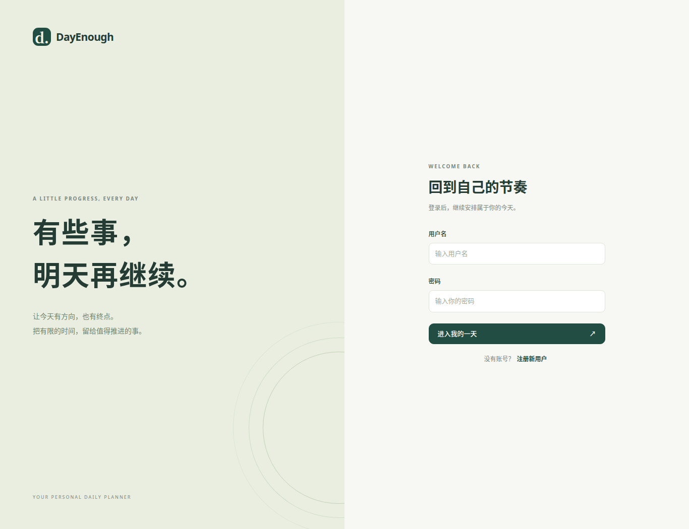
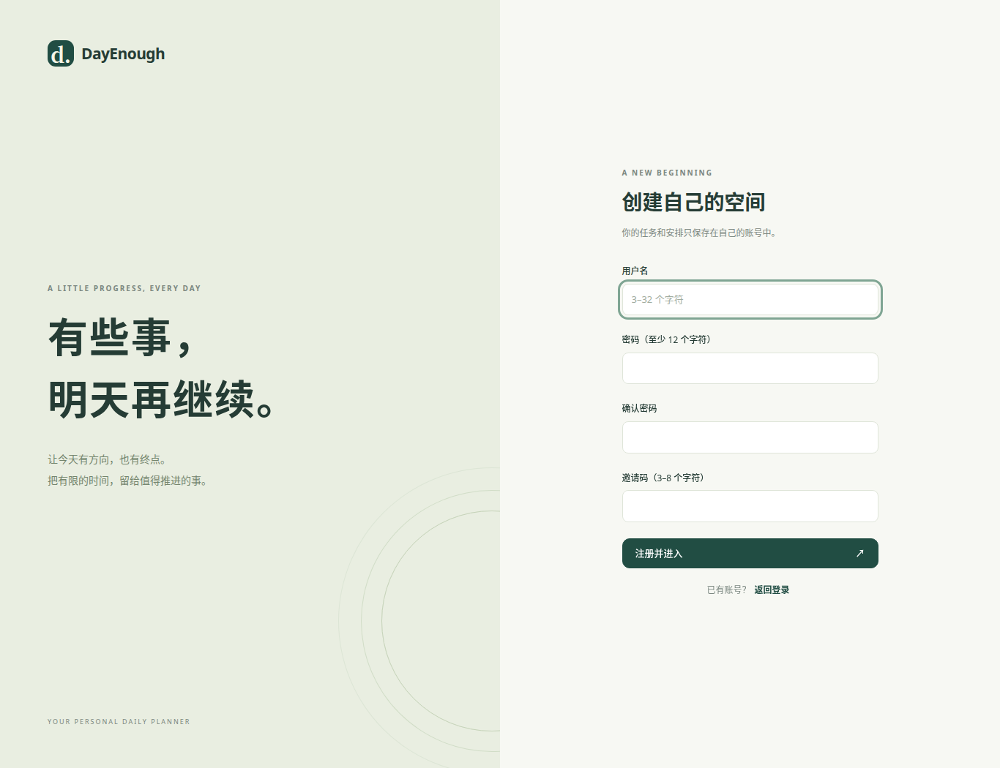
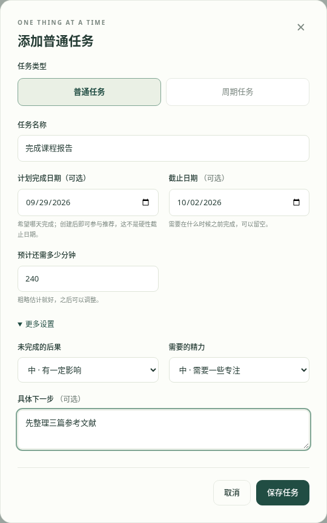
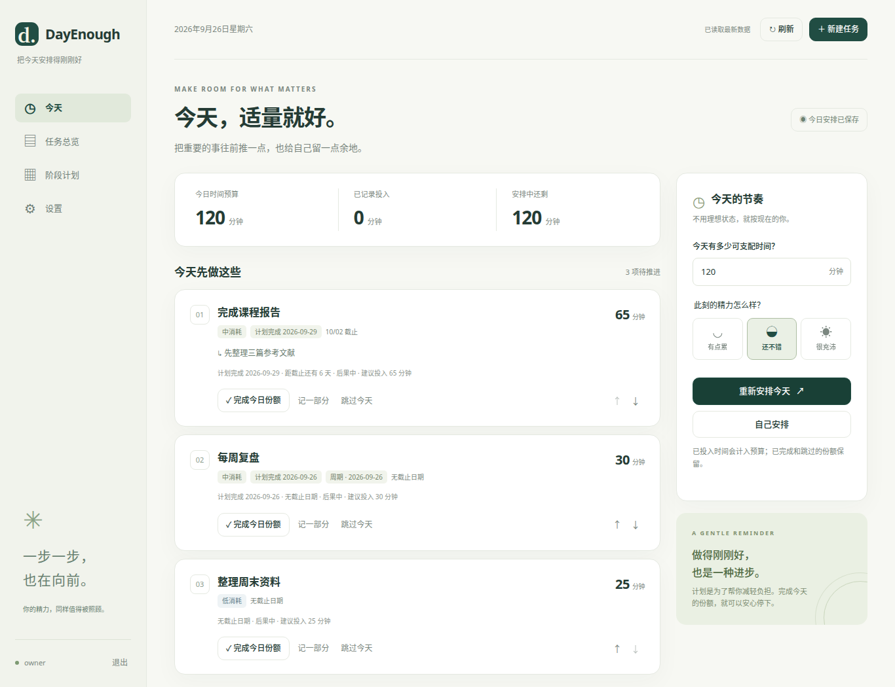
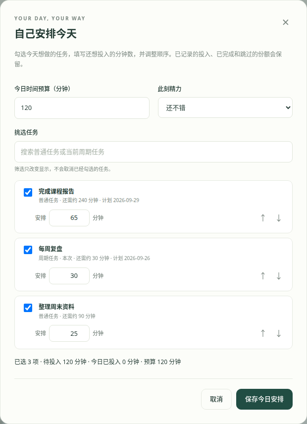
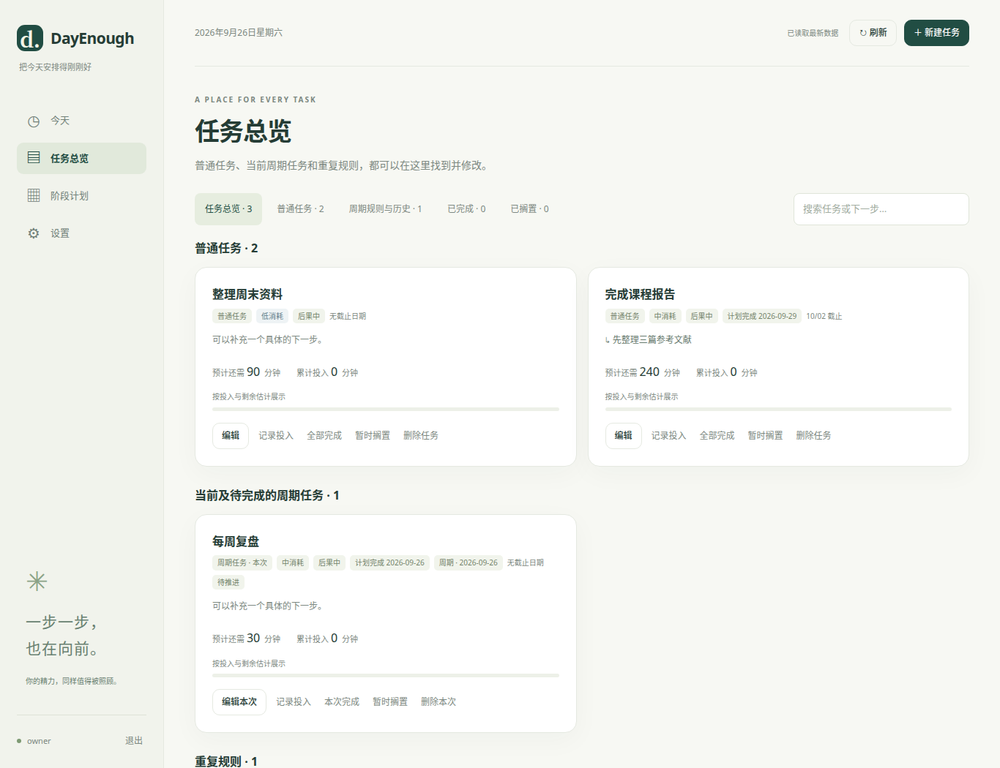
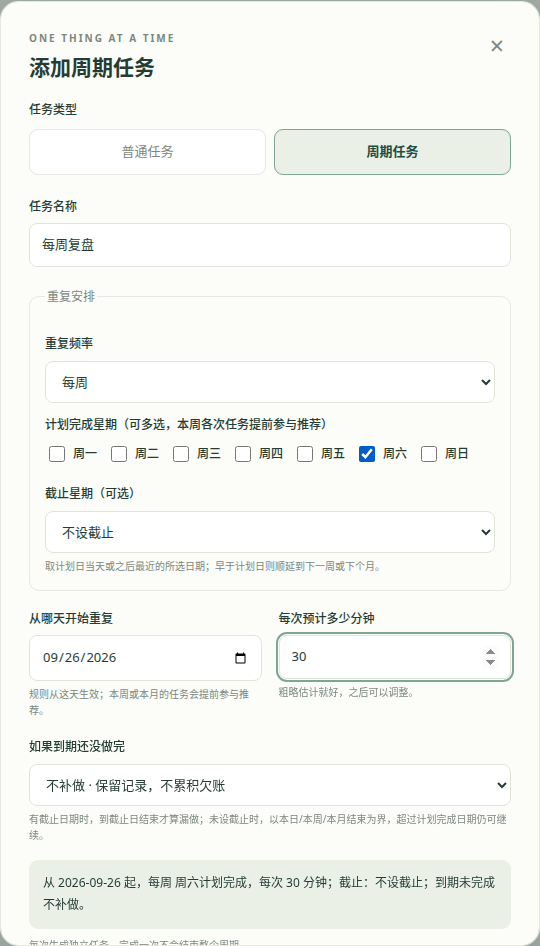
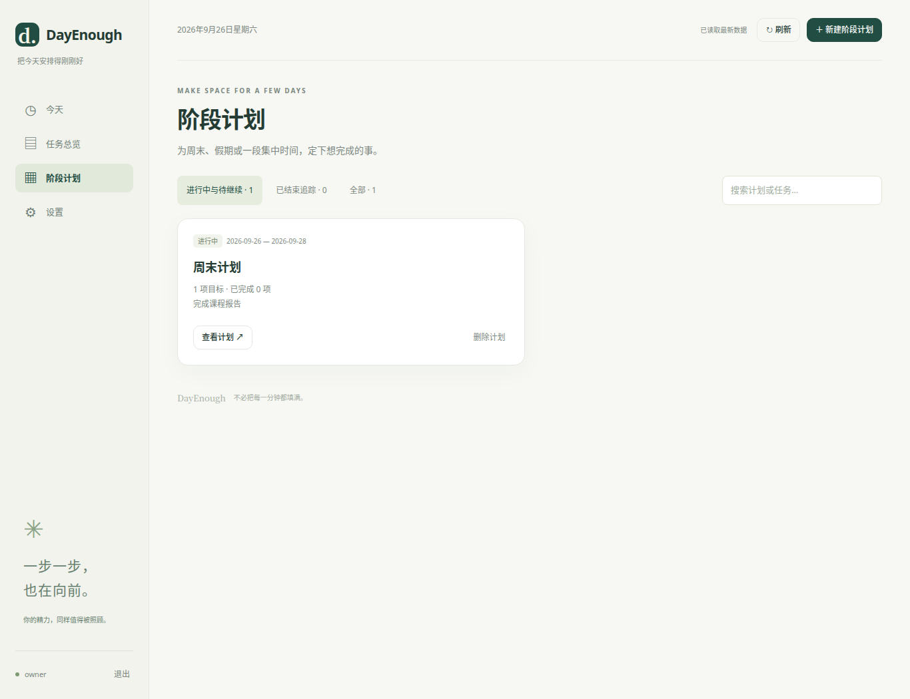
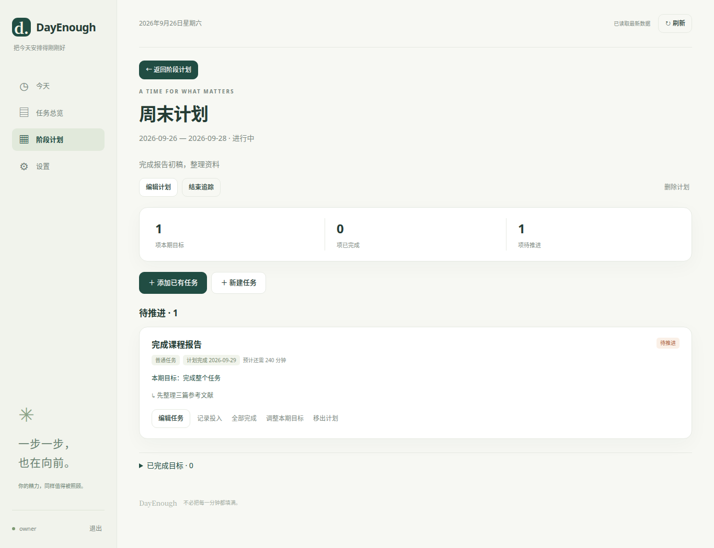
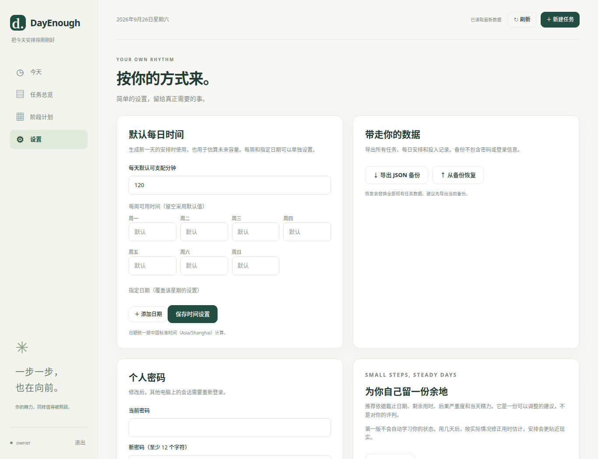

# DayEnough 使用教程

DayEnough 帮你把任务拆成今天做得完的一部分。打开管理员提供的网站地址，就可以在电脑或手机浏览器中使用。**本页截图使用临时账号和虚构任务制作，截图里的日期与任务只是示例。**

## 1. 注册或登录

已有账号时，输入用户名和密码，点击「进入我的一天」。

第一次使用时，点击「注册新用户」，填写用户名、密码、确认密码，以及管理员提供的邀请码，然后点击「注册并进入」。用户名为 3–32 个字符，可使用汉字、字母、数字、下划线和短横线；密码至少 12 个字符，邀请码为 3–8 个字符。没有邀请码或注册入口不可用时，请联系网站管理员。不同账号的任务和设置彼此独立。

## 2. 先添加一件普通任务

登录后，点击右上角「＋ 新建任务」。填写任务名称和「预计还需多少分钟」即可保存。想把计划写得更具体，可以再填写：

- **计划完成日期**：希望哪天完成；创建后就可能进入今日推荐，不必等到这一天。
- **截止日期**：最晚哪天完成；没有明确期限可以留空。
- **具体下一步**：例如「先整理三篇参考文献」，方便开始动手。

「更多设置」里可以调整未完成的后果和需要的精力。估计用时不必精确，之后可以修改。

## 3. 安排今天

进入左侧「今天」，在右边填写今天可支配的分钟数，选择此刻的精力，然后点击「生成今日安排」。页面会显示建议先做的任务、每项建议投入的分钟数，以及推荐理由。建议只保存今天的安排，不会自动替你安排或改写未来几天。

开始做事后，可以按实际情况操作：

| 按钮 | 什么时候用 |
| --- | --- |
| 「记一部分」 | 只做了一部分，填入这次**实际投入**的分钟数。 |
| 「完成今日份额」 | 做完了今天安排给这项任务的剩余份额；系统会按该份额记录投入。整个任务仍可留到以后。 |
| 「跳过今天」 | 今天不做这项，任务本身继续留在任务列表。 |
| 右侧「↑」「↓」 | 调整今天任务的先后顺序。 |

新增或修改任务后，今天已经保存的安排不会自动变化。需要重新分配时，点击右边的「重新安排今天」并确认；已记录的投入、已完成和跳过的份额会保留。

如果你更愿意自己决定今天做什么，点击「自己安排」。勾选任务、修改每项分钟数并用箭头排序，最后点击「保存今日安排」。超过今日预算时会显示提醒，但仍允许保存。

## 4. 查看和修改所有任务

左侧「任务总览」集中显示普通任务、当前周期任务和重复规则。顶部可以按状态筛选，也能搜索任务名称或下一步。

任务卡片上的「编辑」可修改用时、日期等信息；「记录投入」记录实际花费；「全部完成」表示整个任务完成，与「完成今日份额」不同。「暂时搁置」会保留原有进度，之后可以继续推进。删除任务会一并清除它的投入和每日安排记录，确认前请仔细核对。

## 5. 设置每天、每周或每月重复的任务

新建任务时切换到「周期任务」，选择「每天」「每周」或「每月」。例如每周复盘，可选择每周六作为计划完成日，填写每次预计用时。每周可选多个星期；每月可选具体日期或月末。表单里的「从哪天开始重复」是**规则生效日期**，与普通任务的「计划完成日期」用途不同。

「如果到期还没做完」可选择不补做，或保留待办继续推进。每次生成的任务有自己的进度。在「任务总览 → 周期规则与历史」中，可修改或暂停重复规则，也可展开查看各次任务；修改规则不会重写已经生成的任务。新产生的周期任务不会自动加入已保存的今日安排，需要主动重排或自己安排。

## 6. 为周末或假期建立阶段计划

左侧点击「阶段计划」，再点击右上角「＋ 新建阶段计划」。填写名称、开始日期和结束日期；保存后进入详情页，可「添加已有任务」或「新建任务」。每项目标可以是完成整个任务，也可以是在这段时间投入指定分钟数。

计划详情会显示目标总数、已完成数和待推进数，也可以编辑任务或调整目标。阶段计划引用的是原任务：从计划中移出目标，或删除整个阶段计划，都不会删除原任务和投入记录。结束日期后还有未完成目标时，页面会提醒；想停止提醒可点击「结束追踪」。

## 7. 设置时间、密码和备份

左侧「设置」可填写每天默认可用分钟；每周某一天或某个指定日期也可以单独设置。按需要填写即可，空白的星期沿用默认值。这里还能修改当前账号密码。

建议偶尔点击「导出 JSON 备份」，把文件保存到自己的电脑。这个备份只包含**当前账号**的任务、安排、投入和时间设置，不包含密码。「从备份恢复」会替换当前账号已有的任务数据；操作前最好先导出一份当前备份。忘记密码时，请联系网站管理员重置。

如果两台设备同时编辑，页面提示数据已变化时，先刷新，核对最新内容后再操作。页面右上角的「刷新」用于读取服务器最新数据，不会自动重排今天。
